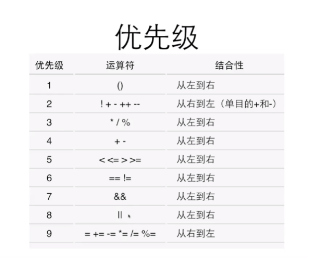

### 技巧整理
#### 1.  逃逸字符
* \b : 回退一格
```
printf("123\bA\n456");
```
```
output:
12A
456
```

#### 2. 強制類型轉換
* (類型)值
    * (int)3.256 
+ 優先級大於四則運算

#### 3. bool
* #include<stdbool.h>
```
bool b = 6>5;
bool t = true;
t = 2;
printf("%d\n", b);
```
```
output:
1
```

#### 4.邏輯運算
* ! : 邏輯非
* && : 邏輯與
* || : 邏輯或
+ 優先級
    + ! > && > ||
    

 
---
2023/09/06