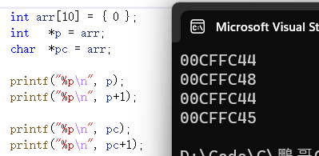

#### 初識指針
> ##### Question
> 1. 內存怎麼編號的?
> 2. 一個單元內存多是大空間?

 4,294,967,296 bit
 /8 = 536,870,912 byte
 /1024 = 524,288 KB
 /1024 = 512 MB
 /1024 = 0.5 GB

 char -> 1byte = 8bit -> 8個地址 [太浪費了!!]
 最終:  一個內存單元一個字節，然後分配地址

```
int main(){

    int a = 10; // a 在內存中要分配空間 - 4個字節

    printf("%p\n", &a); // %p 專門打印地址

    int * pa = &a;
    // pa  用來存放地址，C語言中pa叫"指針變量"
    // *   說明pa是指針變量
    // int 說明pa執行的對象是int類型

    char ch = 'W';
    char * pc = &ch;

    return 0;
}
```
```
int main(){

	int a = 10;
	int* pa = &a;

	*pa = 20;   // * 解引用操作符 | *pa 通過pa裡邊的地址找到a

	printf("%d\n", a);

	return 0;
}

output:
20
```
```
//  指針變量大小
int main() {

	printf("%d\n", sizeof(char*));
	printf("%d\n", sizeof(short*));
	printf("%d\n", sizeof(int*));
	printf("%d\n", sizeof(long*));
	printf("%d\n", sizeof(long long*));
	printf("%d\n", sizeof(float*));
	printf("%d\n", sizeof(double*));

	return 0;
}

output(X64):            output(x86):
8                       4
8                       4
8                       4
8                       4
8                       4
8                       4
8                       4
```
* 指針的大小是相同的!
    * 指針是用來地址的，因此指針需要多大空間，取決於地址存儲需要多大空間
    * 32位 - 32bit - 4byte
    * 64位 - 64bit - 8byte
* 結論: 指針大小在32位平台是4個字節，64位平台是8字節
---
---
#### 指針初階
> ##### 本章重點
> 1. 指針是甚麼
> 2. 指針和指針類型
> 3. 野指針
> 4. 指針運算
> 5. 指針和數組
> 6. 二級指針
> 7. 指針數組
---
###### 1. 指針是甚麼
* 指針是編程語言中的一個對象，通過地址能找到所需的變量單位
* 編號 - 地址 - 指針
* 指針變量: 存放地址
* 總結:
	* 指針是用來存放地址，地址是唯一標示一塊地址空間的
	* 指針的大小在32位平台是4個字節，在64位平台上是8個字節

###### 2. 指針和指針類型
* 指針類型的意義
	1. 指針類型決定了: 指針解引用的權限有多大
	2. 指針類型決定了:指針走一步，能走多遠
		```
		int a = 0x11223344;		int a = 0x11223344;
		int* pa = &a;			char* pc = &a;
		*pa = 0;			*pa = 0;

		debug 內存:			debug內存:
		%a				%a
		44 33 22 11			44 33 22 11
		44 33 22 11			00 33 22 11
		```
		```
		int arr[10] = { 0 };
		int	  *p = arr;
		char  *pc = arr;

		// 整形指針+1相當於跳過一個整型，就是跳過4個字節
		printf("%p\n", p);
		printf("%p\n", p+1);

		// 整形指針+1相當於跳過一個字符，就是跳過1個字節
		printf("%p\n", pc);
		printf("%p\n", pc+1);
		```
		

###### 3. 野指針
* 概念: 指針指向的位置不可知(隨機、不正確、沒明確限制的)
* 成因:
	1. 指針沒初始化
		```
		int main()
		{
			// 這裡的p是野指針
			int* p;	// p是局部指針變量，局部變量不初始化，默認是隨機值
			*p = 20;	// 非法訪問內存

			return 0;
		}
		```

	2. 越界訪問
		```
		int main()
		{
			int arr[10] = {0};
			int* p = arr;
			for(int i=0; i<=10; i++)
			{
				// 當指針指向的範圍超出arr數組時，p就是野指針
				*p = i;
				p++;
			} 
			return 0;
		}
		```

	3. 指針指向的空間釋放
		```
		int* test()
		{
			int a = 10;
			return &a;
		}

		int main()
		{
			int* p = test();
			*p = 20;
			return 0;
		}
		```

* 如何避免野指針
	1. 初始化
		```
		// 不知道初始化為甚麼
		int* p = NULL;
	
		// 明確知道初始化值
		int a = 10;
		int* ptr = &a;   
		```
	2. 小心越界
	3. 指針指向空間釋放及時置NULL
	4. 指針使用之前檢查有效性
		```
		int* p = NULL;
		if(p!=NULL)	// 不為空指針才使用
			*p = 10;
		```

###### 4. 指針運算
* 指針+-整數
	```
	#define N_VALUES 5
	float values[N_VALUES];
	float *vp;

	for(vp = &values[0]; vp < &values[N_VALUES];){
		*vp++ = 0;
	}
	```
	內存:
	| 0 | 0 | 0 | 0 | 0 |
	|-----|-----|-----|-----|-----|

	```
	int main(){

		int arr[10] = {1, 2, 3, 4, 5, 6, 7, 8, 9, 10};

		int *p = arr;
		int *pend = arr + 9;

		while(p<=pend){

			peintf("%d", *p);
			p++;
		}

		return 0;
	}

	output:
	1 2 3 4	5 6 7 8	9 10
	```

* 指針-指針: 得到兩指針間元素之個數
	```
	int main(){

		int arr[10] = {1, 2, 3, 4, 5, 6, 7, 8, 9, 10};
		char c[5];

		// 指針相減的前提: 兩指針指向同一塊空間
		// printf("%d\n", &arr[9]-&c[0]);  ->ERROR
		printf("%d\n", &arr[9]-&arr[0]);
		return 0;
	}

	output:
	9
	```

	```
	// 求字符串長度[指針版]
	int my_strlen(char* str){

		char* start = str;

		while(*str!='\0'){

			str++; 
		}

		return str + start;
	}
	```

* 指針的關係運算

	```
	for(vp = &values[N_VALUES]; vp > &values[0]){

		*--vp = 0;
	}
	```
	內存:
	|start|	|	|	|	|	|
	|---|---|---|---|---|---|
	|  1|	|	|	|	|  0|
	|  2|	|	|	|  0|  0|
	|  3|	|	|  0|  0|  0|
	|  4|	|  0|  0|  0|  0|
	|  5|  0|  0|  0|  0|  0|

> **標準規定:**
	允許指向數組元素的指針與指向數組最後一個元素後面那個內存位置的指針比較，但不允許與指向第一個元素之前的那個內存位置的指針進行比較。

###### 5. 指針和數組

